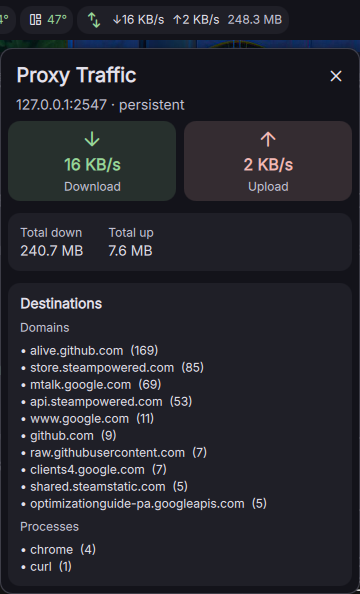
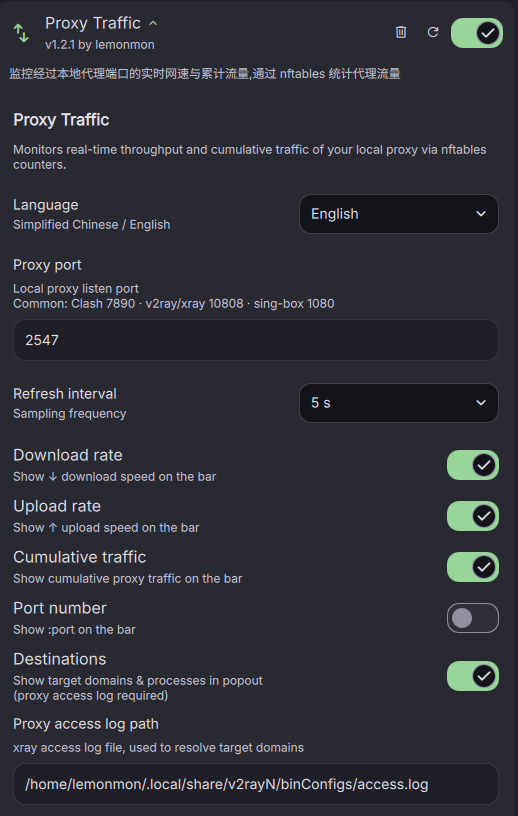

# Proxy Traffic — DMS Plugin

**[简体中文](README_zh-CN.md) · English**

A [DankMaterialShell](https://github.com/AvengeMedia/DankMaterialShell) bar widget that monitors the real-time throughput and cumulative traffic of your local proxy via **nftables** counters.

## Features

- **Bar pill** — live proxy download/upload speed (`↓1.2 MB/s ↑45 KB/s`)
- **Popout panel** — click the pill for a set of cards: live rates, cumulative traffic, history, destinations, redirect
- **Modular popout cards** — each card (speed / cumulative / history / destinations / redirect) can be shown or hidden independently and **reordered** in settings
- **History card** — today's down/up traffic persisted across restarts, with a **line chart** of the last N days (3/7/14/30/90)
- **Proxy-only** — only counts traffic flowing through the local proxy port
- **Redirect breakdown (xray)** — optional per-outbound proxy vs direct byte totals read from xray's StatsService (`/debug/vars`)
- **Configurable display**: toggle download rate / upload rate / cumulative traffic / port on the bar
- Adjustable refresh interval (1–5 s)
- Bilingual UI (zh/en)
- Works with horizontal and vertical bars

## Installation

Clone (or copy) this directory into the DMS plugins folder:

```bash
git clone https://github.com/Lemon-mon-254/dms-proxy-traffic.git ~/.config/DankMaterialShell/plugins/ProxyTraffic
```

Then in DMS: **Settings → Plugins → Scan for Plugins**, enable **Proxy Traffic**, add it to your DankBar layout and restart the shell:

```bash
dms restart
```

## Quick start

Run the one-command installer. It installs `nft` if missing, creates the nftables counters for your proxy port, makes them **persistent** across reboots, and grants passwordless read access:

```bash
cd ~/.config/DankMaterialShell/plugins/ProxyTraffic
sudo ./setup-nftables.sh install
```

Use `PROXY_PORT` if your proxy listens on a non-default port:

```bash
PROXY_PORT=2547 sudo ./setup-nftables.sh install
```

Common proxy ports: **Clash 7890** · v2ray/xray 10808 · sing-box 1080.

`install` performs the following (each also available individually):
- detects/installs `nft` (`nftables`)
- creates the rule file `/etc/nftables.d/proxy-traffic.nft` for your port
- applies the counters immediately
- enables a systemd service (`nft-proxy-traffic.service`) so counters reload on boot
- writes `/etc/sudoers.d/proxy-nft` so the widget reads counters without prompting

> **Note:** re-running `install` (or `create`) resets the counters to zero. Set the plugin's *Proxy port* to the same value you used here.

## Configuration

| Setting | Default | Description |
|---|---|---|
| Proxy port | `7890` | Local proxy listen port (must match the port used to create nftables rules; common: Clash `7890` · v2ray/xray `10808` · sing-box `1080`) |
| Refresh interval | `2s` | Sampling frequency |
| Show download rate | on | `↓ speed` on the bar |
| Show upload rate | on | `↑ speed` on the bar |
| Show cumulative | off | Shows total proxy traffic on the bar |
| Show port | off | Appends `:port` |
| Destinations | off | Popout shows target domains & processes (proxy access log required) |
| Redirect (xray) | off | Popout shows proxy vs direct byte totals per xray outbound |
| **Speed card** | on | Popout card with live down/up speeds |
| **Cumulative card** | on | Popout card with cumulative down/up traffic |
| **History card** | on | Popout card with today's traffic and its line chart |
| Chart days | `7` | How many days of history the line chart shows (3/7/14/30/90) |
| **Order** | — | Reorder the popout cards (up/down buttons per card) |
| xray API port | `2551` | xray API inbound port, used for the redirect view |

> **Important:** the *Proxy port* in settings should match the port used when running `setup-nftables.sh install`, otherwise counters will not match.

## Redirect breakdown (xray only, optional)

When enabled, the popout shows how much traffic left through each xray outbound (`proxy` vs `direct`), read from xray's built-in expvar endpoint:

```bash
http://127.0.0.1:<xray-api-port>/debug/vars   # -> .stats.outbound.{proxy,direct}.{downlink,uplink}
```

- Requires xray/v2rayN to have outbound traffic stats enabled (`policy.system.statsOutboundUplink/Downlink`, enabled by default in v2rayN) and an API inbound (default `2551`).
- No nftables rules needed for this view; it supplements (not replaces) the nftables counter.
- If the port is unreachable, the popout shows a *"xray stats unavailable"* hint instead of failing.

## Managing rules

```bash
sudo ./setup-nftables.sh show          # inspect current counters & service status
sudo ./setup-nftables.sh create        # re-create/apply counters (resets totals)
sudo ./setup-nftables.sh delete        # remove runtime counters (cumulative reset)
sudo ./setup-nftables.sh uninstall     # remove counters + service (+ optionally sudoers)
```

The counters are **persistent** (a systemd service reloads them on boot), so the plugin shows historical cumulative traffic since the table was created, across reboots.

## How it works

The bundled `proxy-traffic-split` script reads the nftables counters and emits one JSON line:

```json
{"up": 118045, "down": 454352, "persistent": true}
```

- `up` — bytes sent to the local proxy port (application → proxy)
- `down` — bytes received from the local proxy port (proxy → application)

The QML widget diffs consecutive samples to derive live rates, matching the difference between samples over the elapsed time.

## Screenshot





## Requirements

- DankMaterialShell >= 1.4.0
- `nft` (nftables), `sudo`
- A local proxy listening on the configured port (e.g. v2ray/xray/sing-box/clash)
- Optional (redirect view only): `curl` + `jq`, and an xray/v2rayN proxy

## License

MIT
