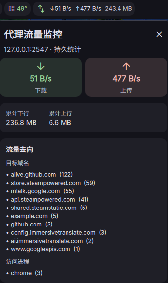
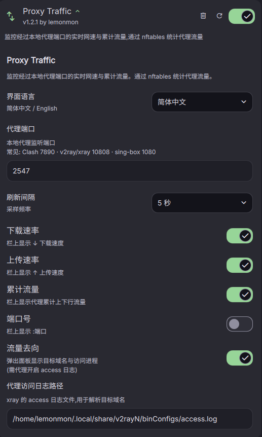

# Proxy Traffic — DMS 插件

**简体中文 · [English](README.md)**

一个针对 [DankMaterialShell](https://github.com/AvengeMedia/DankMaterialShell) 的 DankBar 组件，通过 **nftables** 计数器实时监控本地代理的网速与累计流量。

## 特性

- **栏上胶囊** — 实时代理下载/上传速度（`↓1.2 MB/s ↑45 KB/s`）
- **弹出面板** — 点击胶囊查看详细的速率与累计流量（下行/上行）
- **仅统计代理** — 只统计经过本地代理端口的流量
- **可配置显示**：在栏上切换 下载速率 / 上传速率 / 累计流量 / 端口号
- 可调刷新间隔（1–5 秒）
- 同时支持横向和纵向工具栏

## 安装

将本目录克隆（或复制）到 DMS 插件目录：

```bash
git clone https://github.com/Lemon-mon-254/dms-proxy-traffic.git ~/.config/DankMaterialShell/plugins/ProxyTraffic
```

然后在 DMS 中：**设置 → 插件 → 扫描插件**，启用 **Proxy Traffic**，将其添加到 DankBar 布局并重启：

```bash
dms restart
```

## 快速开始

运行一键安装命令。它会：检测/安装 `nft`（如缺失）、为你代理端口创建 nftables 计数器、将其**开机持久化**、并授予无密码读取权限：

```bash
cd ~/.config/DankMaterialShell/plugins/ProxyTraffic
sudo ./setup-nftables.sh install
```

如果你的代理监听在非默认端口，用 `PROXY_PORT` 指定：

```bash
PROXY_PORT=2547 sudo ./setup-nftables.sh install
```

常见代理端口：**Clash 7890** · v2ray/xray 10808 · sing-box 1080。

`install` 一次完成下面几步（也可单独使用）：
- 检测并安装 `nft`（`nftables`）
- 为你的端口生成规则文件 `/etc/nftables.d/proxy-traffic.nft`
- 立即应用计数器
- 启用 systemd 服务（`nft-proxy-traffic.service`），开机自动加载
- 写入 `/etc/sudoers.d/proxy-nft`，让组件无密码读取计数器

> **注意：** 重新运行 `install`（或 `create`）会把计数器清零。请把插件中的"代理端口"设置为与本次相同。

## 配置项

| 设置 | 默认值 | 说明 |
|---|---|---|
| 代理端口 | `7890` | 本地代理监听端口（须与创建 nftables 规则所用的端口一致；常见：Clash `7890` · v2ray/xray `10808` · sing-box `1080`） |
| 刷新间隔 | `2s` | 采样频率 |
| 下载速率 | 开 | 栏上显示 `↓ 速度` |
| 上传速率 | 开 | 栏上显示 `↑ 速度` |
| 累计流量 | 关 | 栏上显示代理累计上下行流量 |
| 端口号 | 关 | 追加显示 `:端口` |

> **重要：** 设置中的"代理端口"应与运行 `setup-nftables.sh install` 时的端口一致，否则计数器将不匹配。

## 规则管理

```bash
sudo ./setup-nftables.sh show          # 查看当前计数器与服务状态
sudo ./setup-nftables.sh create        # 重新创建/应用计数器（累计清零）
sudo ./setup-nftables.sh delete        # 删除运行时计数器（累计清零）
sudo ./setup-nftables.sh uninstall     # 移除计数器 + 持久化服务（可选移除免密）
```

计数器是**持久**的（由 systemd 服务在开机时重新加载），因此插件会显示自创建以来、跨重启累计的历史流量。

## 运行原理

随附的 `proxy-traffic-split` 脚本读取 nftables 计数器并输出一行 JSON：

```json
{"up": 118045, "down": 454352, "persistent": true}
```

- `up` — 发送到本地代理端口的字节数（应用 → 代理）
- `down` — 从本地代理端口接收的字节数（代理 → 应用）

QML 组件对连续采样做差分运算，从而得到实时速率。

## 屏幕截图





## 环境要求

- DankMaterialShell >= 1.4.0
- `nft`（nftables）、`sudo`
- 一个监听在已配置端口上的本地代理（例如 v2ray/xray/sing-box/clash）

## 许可证

MIT
